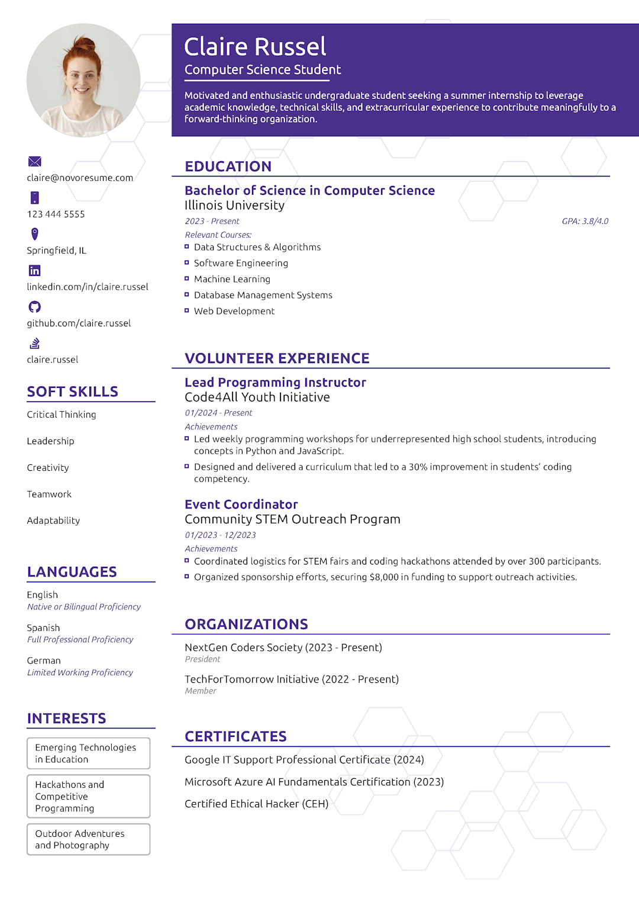
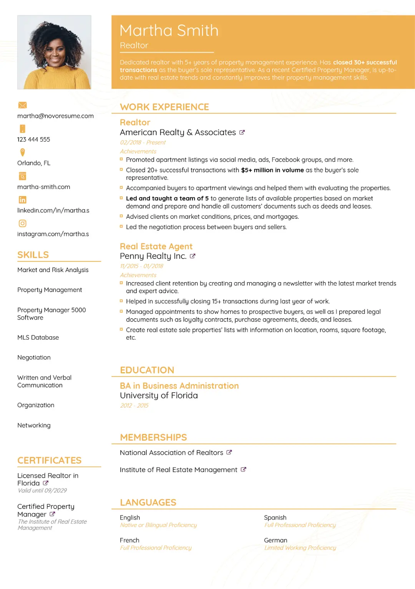

# 🎓 Professional CV & Resume Portfolio

A collection of high-quality, ATS-friendly, and modern CV templates designed for professionals across all industries.

## 📝 Intro
This repository showcases my expertise in resume writing and designing. Each template is crafted to highlight skills effectively and pass through modern recruitment software.

## 🖼 Screenshots
Below are some of my top-rated designs. Click on the images to view them in high resolution.

| Modern Design | ATS-Friendly | Corporate Style |
| :--- | :--- | :--- |
|  |  |  |

## 🛠 Features
1. **ATS Optimization:** Layouts that hiring bots can read easily.
2. **Custom Branding:** Colors and fonts tailored to your profession.
3. **Multi-Format:** Available in PDF, DOCX, and PNG formats.

## 📂 File Structure
- `/Templates` : Contains all visual CV samples.
- `README.md`  : Project overview and guide.

---

## 🚀 Hire Me on Fiverr
Ready to get your dream job? Let's create your professional CV today!
👉 [**Visit My Fiverr Profile**](APNA_LINK_YAHAN_DALEN)
